# CantoTrack Mobile

Your tickets, the clock and your hours, on your phone.

The Android app of the [CantoTrack](https://github.com/szabolevi98/cantotrack)
issue tracker, for the part of the work that happens away from a desk. The web
is where work is planned; the phone is where it is started, stopped and noted
down. The app works through CantoTrack's JSON API: a person signs in with their
own account, starts the clock on a ticket, and stops it later — on the phone, on
the web or from the notification shade, as it is one and the same clock.

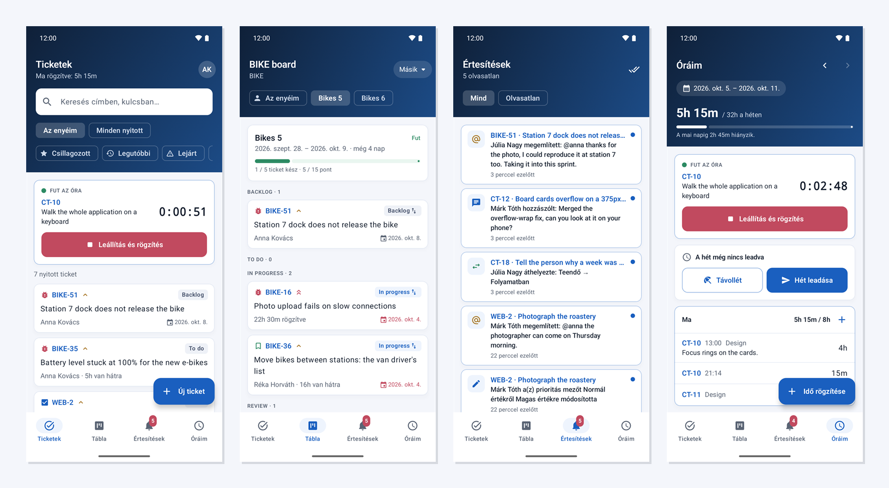

Written in Kotlin with Jetpack Compose and Material 3, in the web app's colours,
light and dark. Runs on Android 8.0 and later.

## What it does

Four tabs: the tickets, the board, the notifications and your hours.

### Tickets

- **Mine, or every open one**: the first tab lists the open tickets assigned to
  you, or with one tap every open ticket in the projects you can see, a page at a
  time, with a search over titles and keys. Each shows its type, priority,
  status, assignee, the hours logged and left, and its due date — in red once
  it has passed.
- **Quick filters** under the search: your **starred** tickets, the ones you
  **opened lately** (on the web or here), the **overdue** ones, the ones **due in
  the next seven days**, **bugs**, one **project** — and a **query** in the web's
  own query language (`project = CT AND priority = high`), tried once or kept
  under a name of your own.
- **A new ticket**, for what you find on the way: project, type, title, text,
  priority, who it goes to and when it is due — and **photos** straight from the
  camera, pictures from the phone or any file, sent with it. A photo is turned
  the right way up and made smaller first (a phone's twelve megapixels are more
  than a server takes, or needs).
- **A ticket**: its facts, labels, epic, sprint and parent, its description,
  **subtasks** and **links** (each a tap away), its **files** — pictures as
  thumbnails, anything opened in the phone's own app for it — **who logged how
  much** on it, and its comments. The link at the top opens it on the web.
- **Changing it**: a tap on a fact changes it — the **status** (to the columns
  the project's workflow allows), the **priority**, **who it is given to**
  ("Take it" gives it to you with one tap), the **due date**, the **sprint**
  (or back to the backlog), and the **title and text**. **Star** it, and it comes
  first when you log time; **follow** it, and its changes reach your
  notifications. A change somebody else made in the meantime is refused by the
  server rather than overwritten, and the app says why in the server's own
  words.
- **Comments**: written at the bottom of the ticket, above the keyboard; your own
  corrected or taken back.
- **Files**: a photo, a picture or a file added to a ticket from its page;
  yours deleted with a long press.

### The board

The third tab is a board's sprint, the way a phone can show it: not columns to
drag across, but the columns one under the other, each with its tickets, and
above them the sprint itself — its dates, the days left, its goal, and how far
it has got by tickets and by story points. The running sprint first, the
planned ones a tap away; **mine only** with another tap; any other board (a
project's own, or a shared one) from the list. A ticket goes to **another
column** from the status on its card — to the status of that column its own
project has, on a board shared by several. Planning — making, starting and
closing sprints — stays on the web.

### Notifications

The bell of the web, on the phone: who mentioned you, what was given to you,
what changed on the tickets you follow — newest first, the unread ones marked,
and how many on the tab. A tap opens the ticket and reads it; all of them are
read with one tap at the top.

CantoTrack has no push service to reach a phone by itself, so the phone asks:
**every quarter of an hour in the background**, at a moment Android chooses to
save the battery, and **every minute while the app is open**. What is new goes
into the notification shade, one notification for each, grouped; the very
first look after signing in only notes where things stand, so a phone that has
just signed in is not shown a month of old news. It can be turned off in the
settings.

### The clock

CantoTrack keeps one running clock per person, on the server. The app shows and
drives that same clock:

- **Start** it on a ticket. One already running on another ticket is stopped and
  logged first, as on the web, and the app says how much it logged.
- **While it runs**, it sits at the top of both tabs, counting, and in the
  notification shade, where the system keeps counting with the app closed. The
  shade has a **Stop** button of its own.
- **Stop** it with a note and it becomes a worklog on the day it started; under
  a minute, nothing is logged. Or throw it away without logging.
- Started or stopped **on the web**? The app reads the clock again each time it
  comes to the front. It counts from how long the server says the clock has run,
  so a phone clock that is minutes off does not show the wrong time.

No background service runs for any of this: the clock is on the server, and the
counter in the shade is the notification's own.

**Outside the app**, too:

- a **home screen widget** with the ticket the clock runs on, the counter, today's
  hours and a **Stop** button — or, while it is not running, **Start** on the
  ticket it ran on last;
- a **quick settings tile**: on while the clock runs, with its ticket under the
  name; a tap stops it and logs the time, or starts it again on the last ticket;
- a **long press on the app's icon**: log time, a new ticket, the clock.

### Hours

- **Log time by hand**: how long (in quarter hours, or 15 minutes to 2 hours with
  one tap), which day (today, yesterday or any earlier day), as what kind of
  work (the installation's **work types**) and a note — on a ticket's page, or
  from the hours tab on any ticket. The tickets offered first are the ones you
  would log on: **starred, logged on lately, in progress**; typing finds every
  ticket, closed ones too.
- **The week against what it asks for**: the last tab is your hours a week at a
  time, against your own working week — "5h 15m / 32h", with a bar, and how much
  is missing up to today. Each day shows its hours beside its own target; a
  public holiday or a day away is named and asks for nothing, and a working day
  gone by with too little is marked. Step a week back or forward, or tap the
  week's dates for a calendar and jump to any week.
- **Handing the week in**: where it stands — not handed in, waiting for approval,
  approved, or **sent back with the reason** — and a button that hands it in.
  A handed-in or approved week, and a closed day, take no more hours.
- **Days away**: vacation, sick days and the rest, added from the hours tab for a
  day or a span of days, and taken off again — the days then ask for no hours,
  as on the web.
- **Correcting an entry**: a tap on an entry opens it with its time, day, work type
  and note, to change or delete, or to open its ticket. Hours already billed are
  refused by the server, as on the web.
- **Today's total** is in the header of the tickets tab, and on the widget.

### A bad connection

On a train the answer to "log 45 minutes" can be lost after the server has
already logged them. The app then says it could not reach the server — and
tapping again is safe: every change (logging and correcting hours, a comment,
a ticket, a file, the clock) goes with an `Idempotency-Key`, the same one when
the same change is sent again, and CantoTrack answers a resend with its first
answer instead of doing it twice. A file is sent the same way byte for byte, so
a photo sent again after a lost answer is not attached twice either. Once the server has answered, the key is done with,
so logging the same time again on purpose logs it again.

### Security

- Everybody signs in with **their own CantoTrack account**: email address and
  password. The server makes a personal access token for the device; the phone
  keeps it encrypted with an Android Keystore key that never leaves the device,
  and the app's data is left out of backups.
- **Two-step sign-in**: a person who has turned it on in CantoTrack is asked for
  the code from their authenticator app after the password, or one of their
  recovery codes. Without it there is no extra step.
- The sign-in shows on the web, on **Profile → Access tokens**, with an *App*
  badge and the device's name, and can be revoked there. A new password, a reset
  one or **Sign out everywhere else** signs the phone out too; so does a
  deactivated account. The app then goes back to the sign-in screen.
- Wrong passwords and codes count towards the same limit as the web's login form.
- The release build talks HTTPS only. Plain HTTP is allowed in the debug build,
  for a local server reached from the emulator (`10.0.2.2`).

### Languages

Hungarian and English, following the phone's language; from Android 13 the
app's language can be chosen on its own in the system settings. The server's
error messages come in the language set on your CantoTrack profile.

## Screens

| Sign-in | Tickets, the clock running | A ticket |
|---|---|---|
| 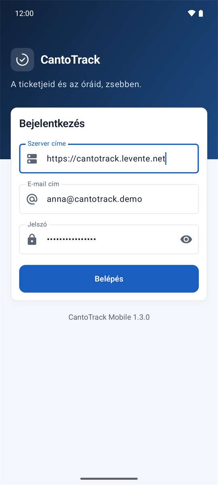 | 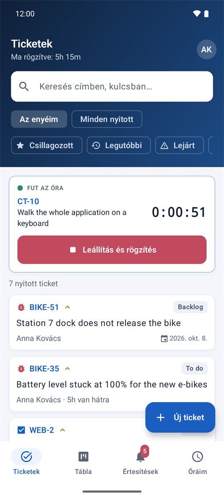 | 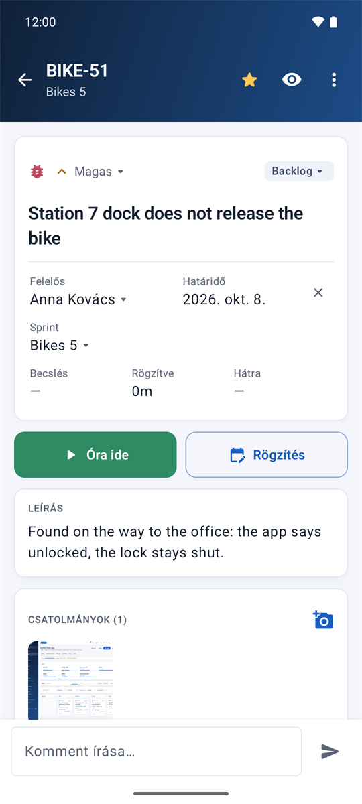 |

| A new ticket, with a photo | The board | Notifications |
|---|---|---|
| 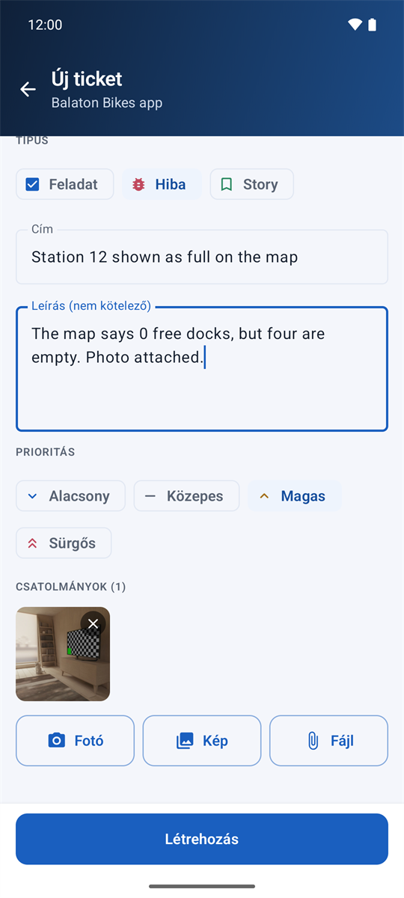 | 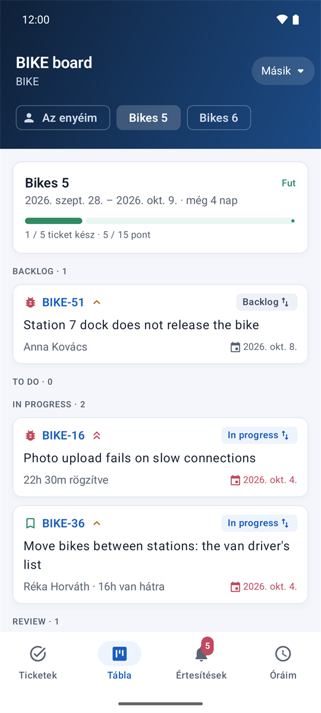 | 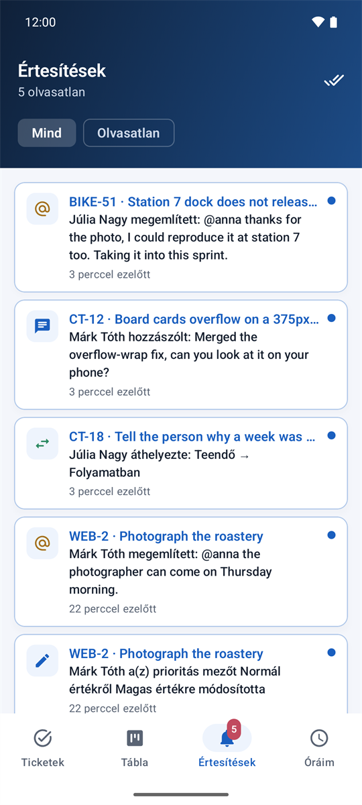 |

| The week against its target | Logging time | The widget |
|---|---|---|
| 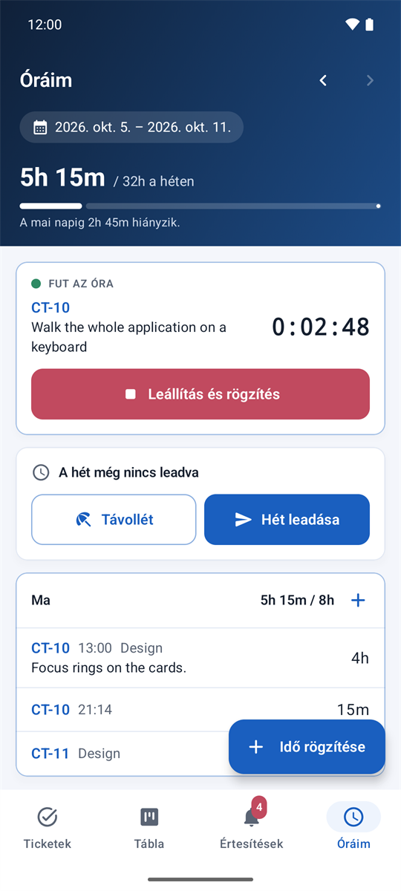 | 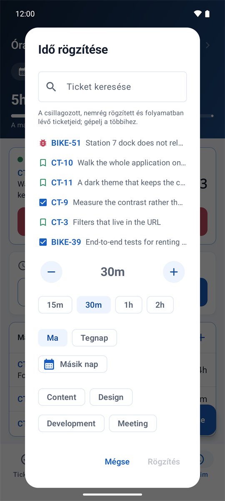 | 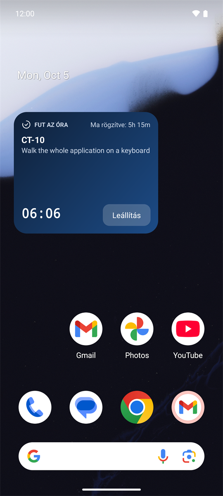 |

| The quick settings tile | Dark |
|---|---|
| 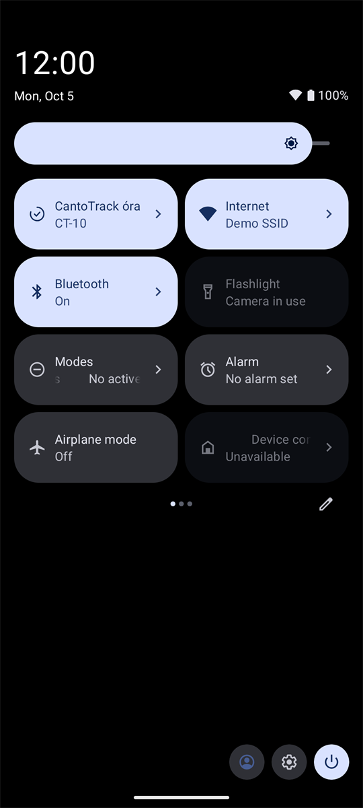 | 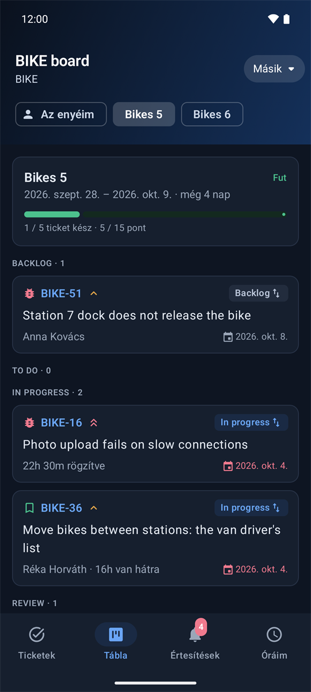 |

## Installing it

1. Download the latest `cantotrack-mobile-*.apk` from the
   [releases](https://github.com/szabolevi98/cantotrack-mobile/releases) page.
2. Install it on the phone. The first time, Android asks to allow apps from
   unknown sources.
3. On first start, enter the CantoTrack server's address (say
   `tracker.example.com`), your email address and your password — and, with
   two-step sign-in on, the code from your authenticator app.

It needs **Android 8.0 (API 26)** or later, and a CantoTrack server with the
app's endpoints (`/api/v1/auth/login`, `/api/v1/auth/logout`, `/api/v1/timer`) —
any version from 26 September 2026 on, with `php database/migrate.php` run.
Correcting an entry (from 1.1) needs `PATCH /api/v1/worklogs/{id}` as well, which
CantoTrack has had since the evening of the same day. Resending safely (from
1.2) needs a CantoTrack that knows `Idempotency-Key`, from the night of the same
day; an older one ignores the header, and the app works as before. The week's
targets, handing it in, days away, starring and the tickets offered for logging
(from 1.3) need `/api/v1/week`, `/api/v1/absences`, `/api/v1/starred`,
`/api/v1/recent` and `/api/v1/tickets/suggested`, from 5 October 2026; against an
older server the hours tab shows the week without its targets.

## Building it

| Layer | |
|---|---|
| Language, UI | Kotlin 2.4, Jetpack Compose, Material 3 in the web app's colours |
| Network | OkHttp 5 and kotlinx.serialization |
| Storage | DataStore; the token encrypted with an Android Keystore AES-GCM key |
| Background | WorkManager, for the look at the notifications every quarter of an hour |
| Build | Gradle 9.7, Android Gradle Plugin 9.4, compileSdk 37, minSdk 26 |

```
./gradlew assembleDebug                 # a debug build for a local server (from the emulator: http://10.0.2.2/cantotrack/web)
./gradlew testDebugUnitTest             # the API client against a mock server, and the formatting
./gradlew connectedDebugAndroidTest     # on a running emulator: signing in, with and without two-step sign-in
./gradlew assembleDebug -PminifyDebug   # a debug build shrunk by R8 exactly like the release
```

A signed release build needs a `keystore.properties` in the project root (never
committed):

```properties
storeFile=C:/path/to/release.jks
storePassword=...
keyAlias=cantotrack-mobile
keyPassword=...
```

Without it, `./gradlew assembleRelease` makes an unsigned APK.

### Layout

```
app/src/main/java/net/levente/cantotrack/mobile/
  data/api/        the CantoTrack API client, its models and errors
  data/session/    sign-in, the encrypted token, expiry
  data/timer/      the running clock: its notification, the widget, the tile, their buttons
  data/news/       the unread count, and the background look at the bell
  data/files/      files downloaded and opened, photos made ready to send
  ui/home/         the tickets tab and its filters
  ui/board/        the board tab
  ui/news/         the notifications tab
  ui/newticket/    a new ticket
  ui/ticket/       a ticket, its facts, files, comments and logging time
  ui/hours/        the week's hours, handing it in, days away
  ui/login/, ui/settings/
  ui/components/   shared pieces: header, card, the clock's card, pickers and dialogs
  ui/theme/        the web app's design tokens, light and dark
app/src/test/          unit tests
app/src/androidTest/   tests on a device or emulator
```

The API is described in the CantoTrack repository, in
[docs/API.md](https://github.com/szabolevi98/cantotrack/blob/main/docs/API.md) — and
inside CantoTrack itself, under **API documentation** in the account menu.

## License

[GNU AGPLv3](LICENSE), like CantoTrack. © 2026 [szabolevi98](https://github.com/szabolevi98)
